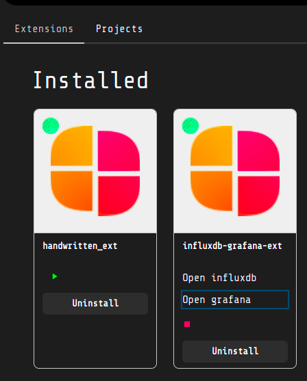
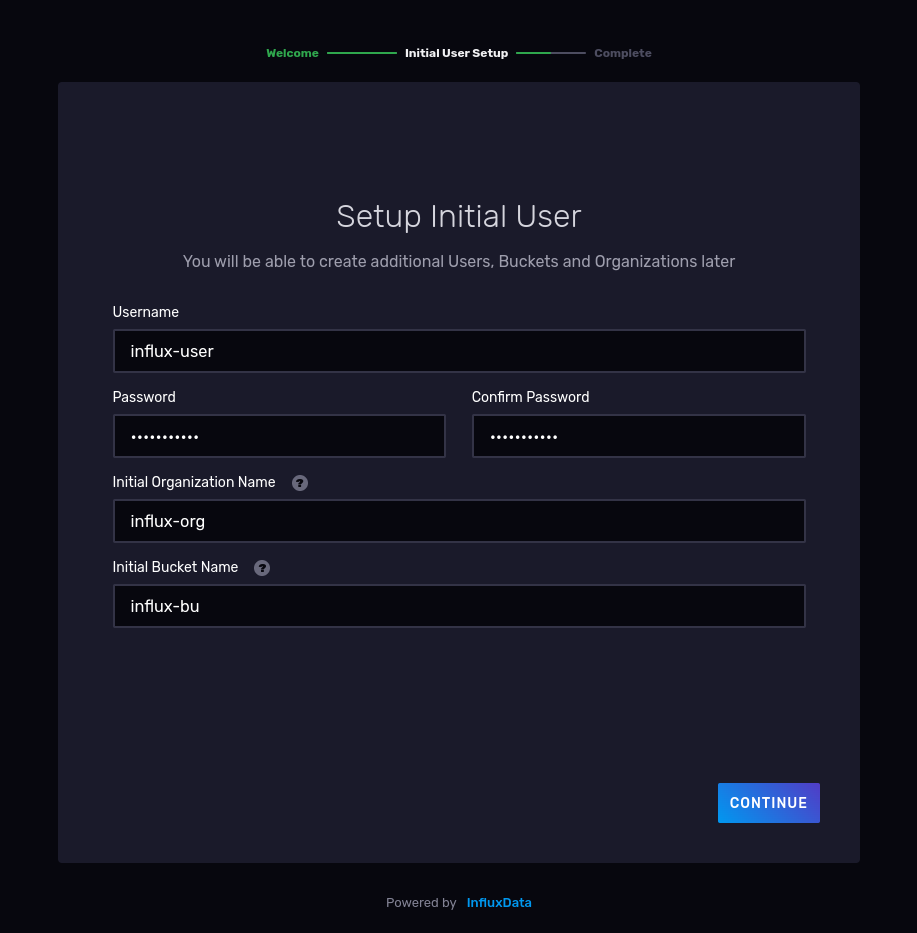
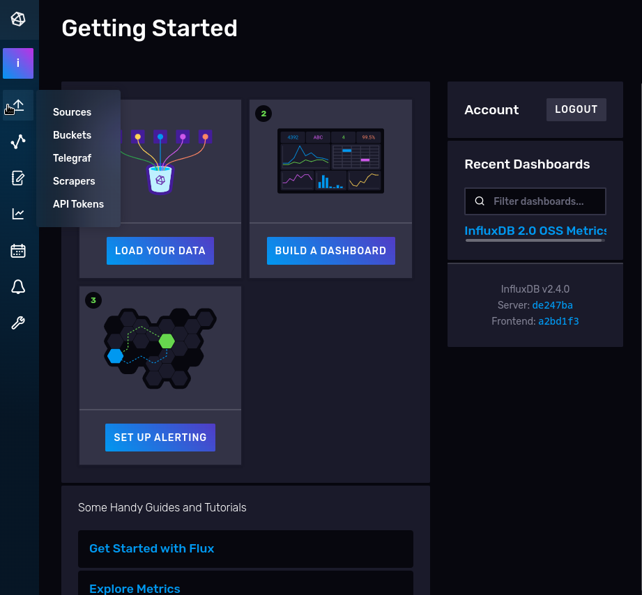
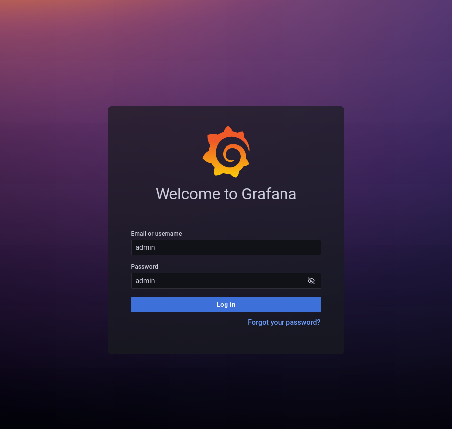
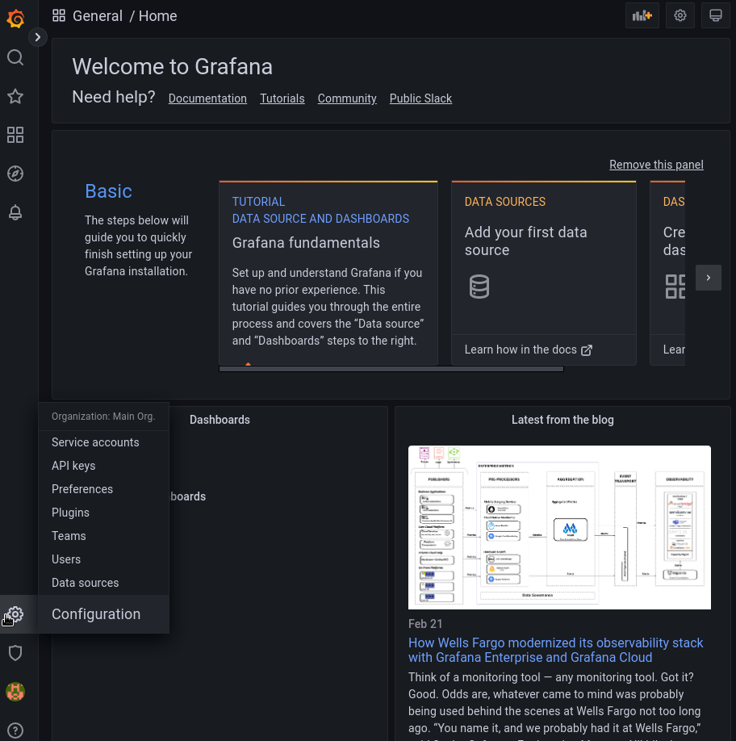
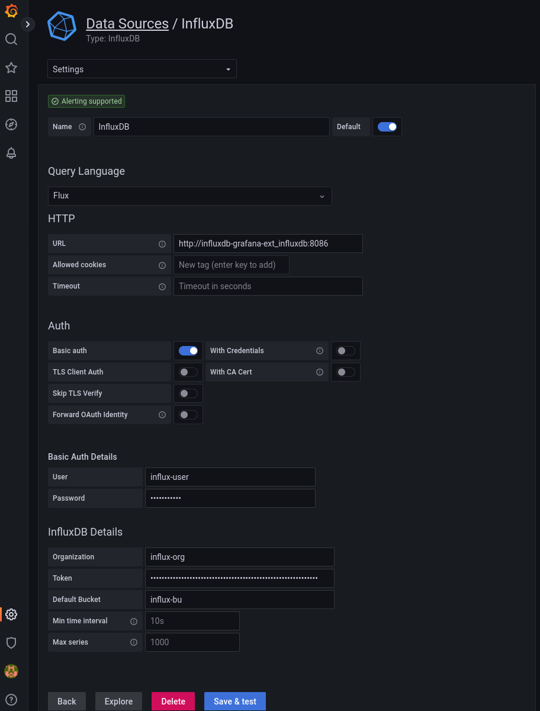

# Influxdb-grafana-ext #

With this extensions you can use Influxdb and Grafana inside Loko ;)

## Important!

This project will mount volumes inside this path:
```bash
/var/opt/loko/influxdb-grafana-ext/
```
Before starting it the first time, run this command in your terminal:

```bash
sudo mkdir -p /var/opt/loko/influxdb-grafana-ext/grafana-data && sudo chmod 777 /var/opt/loko/influxdb-grafana-ext/grafana-data
```

## How to configure and connect InfluxDB with Grafana

Firts of all, press "Play" button and run the project. When all the container will be started, 
you will see two GUI link available.



### Configure InfluxDB. 
Open InfluxDB gui and then follow these steps:
- Insert in any fields the same configurations you have setted in your config.json file (under "influxdb" environments) and then click "Continue"


- Select "Quick Start" button, you will be taken to the home page.
- On the left side you can see a menu bar, select the first icon and the click on "API Tokens"

- You can see one token, click on its name to reveal the related token _(it will be used for the connection from Grafana to InfluxDB)_. 


### Connect InfluxDB database with Grafana.
Open Grafana gui and follow these steps:
- login to Grafana using username and password configured in your config.json file (under "grafana" environments)

- on the side you can see a menu bar, select the "gear" icon on the bottom and then click on "Data Sources"

- add new data source clicking the blue botton, then select "InfluxDB" from the list, and configure the db with these configurations:
  - Name: you can leave it default
  - Query Language: select "Flux" from dropdown list
  - URL: follow this form --> http://<project-name>_<influxdb-service-name>:<influxdb-internal-port>.
    If you not edit config.json file, the url will be this:  http://influxdb-grafana-ext_influxdb:8086

    _(you can also take the url using "docker ps" command in you terminal and copy influxdb "name", and add the port at the end)_
  - under "Basic Auth", set "User" and "Password" with the same you had chosen in InfluxDB
  - under "InfluxDB Details", set "Organization" and "Default Bucket" with the same you had chosen in InfluxDB, and under "Token" set the "API Token" you have seen in the last step of the InfluxDB Configuration.
  
  - press "Save & test" button and you will be connected to your InfluxDB databased 😉
